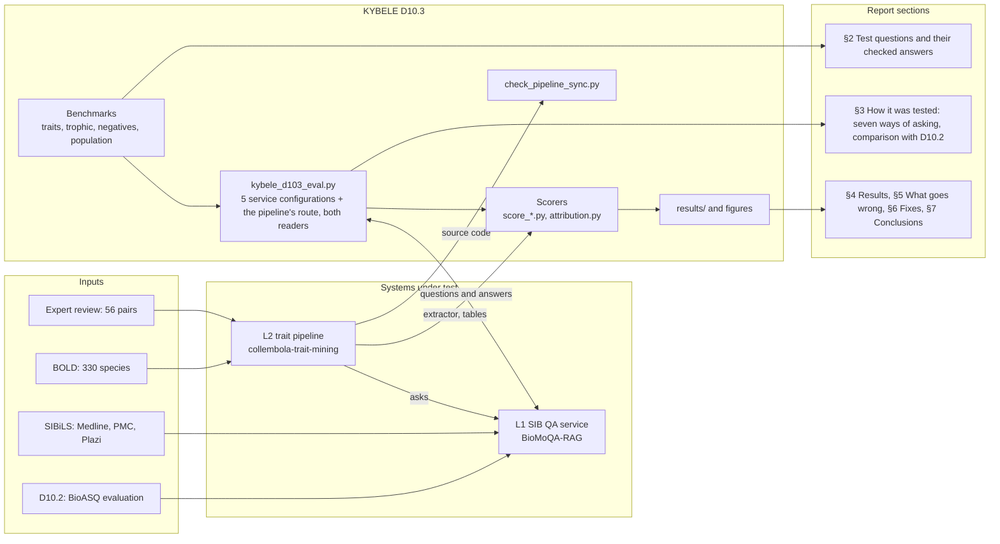

# KYBELE D10.3 evaluation: Collembola trait question answering

This repository publishes the scripts, benchmark and results of deliverable D10.3 of KYBELE
(Knowledge Yield from BiodivErsity Literature through LLM Extraction), an ELIXIR-funded project
(January–December 2026; ELIXIR Greece, Italy and Switzerland; leads Stelios Ninidakis and
Patrick Ruch). D10.3 is titled
"Model evaluation results based on a curated sample of taxonomic treatments (N>100 instances)
and the actions to optimize the entire system". It evaluates the SIB / SIBiLS biomedical and
biodiversity question-answering service (API `https://qa.sibils.org/api`, code
[sibils/BioMoQA-RAG](https://github.com/sibils/BioMoQA-RAG) at commit `13abd69`; generative
model Qwen/Qwen3-8B-FP8, extractive reader ktrapeznikov/biobert_v1.1_pubmed_squad_v2, as reported
by the service during the runs) on 126 curated questions about the body size, habitat and trophic
guild of Collembola (springtails), taken from Plazi taxonomic treatments, in five retrieval and
answering configurations of the service and in the request path of the KYBELE trait-mining
pipeline that consumes it (a sixth configuration, `pipeline`).

## Three layers

| Layer | What it is | Where it is evaluated |
|---|---|---|
| L1 QA service | SIB's BioMoQA-RAG at `qa.sibils.org` (retrieval and reader) | D10.2 on BioASQ; here, the five service configurations |
| L2 trait pipeline | [ecsltae/collembola-trait-mining](https://github.com/ecsltae/collembola-trait-mining): asks the service, turns answers into trait values, publishes the trait table | here: the `pipeline` configuration (live), `score_pipeline_output.py` (its published version 3 table), the stored value of `score_traits.py`/`score_trophic.py`, and the expert review in that repository |
| L3 this repository | Independent gold, runner, scorers, layer attribution | — |

The species pipeline does **not** use the service's own retrieval: it runs a phrase search for
the binomial (Medline and PMC title, abstract and keywords, Plazi text; 6 hits per collection)
and passes those documents to the generative reader through `doc_refs`, then keeps the first
non-empty answer. Only its genus batch uses the API default (`e2e_sparse_generative`). The
`pipeline` configuration reproduces both paths; `scripts/check_pipeline_sync.py` checks the
copy against the pinned upstream code.

## How the parts fit together



A drawn version is `results/figures/flowchart.png`.

## Repository layout

| Path | Content |
|---|---|
| `data/benchmark_traits.csv` | The trait benchmark: 126 questions with gold answers |
| `data/sampling_frame.csv` | Metadata of the 859 Plazi treatments the questions were drawn from (no treatment text) |
| `data/curation/traits/` | Raw candidates and curation decisions for the trait benchmark (two rounds) |
| `data/benchmark_trophic.csv` | The trophic-guild benchmark: 102 diet questions (81 species, 21 genus level) with gold food items and gold guilds |
| `data/curation/trophic/` | Candidate sentences, review sheets, curation decisions and `build_trophic.py` for the trophic-guild benchmark |
| `scripts/kybele_d103_eval.py` | QA runner (v6): sends the questions to the QA API in five service configurations and the trait pipeline's own request path (`pipeline`); `--configs` selects a subset |
| `scripts/check_pipeline_sync.py` | Checks the pipeline constants copied into the runner and scorers against collembola-trait-mining at the pinned commit |
| `scripts/score_pipeline_output.py` | Scores the pipeline's published version 3 trait table and its genus table against the gold of this repository (offline L2 benchmark) |
| `scripts/attribution.py` | Attributes errors to retrieval, reading, answer selection and extraction on the same items |
| `scripts/rigor_analysis.py` | Stricter measures: error size for body size, label-level precision and recall, selective answering by confidence, bootstrap intervals |
| `scripts/reader_comparison.py` | Extractive against generative reader on identical documents (McNemar), and the precision–recall grid of retrieval × reader × version 3 extraction |
| `scripts/make_negatives.py` | Builds the negative items (`NOT_DOCUMENTED` gold) from the sampling frame |
| `scripts/make_population_sample.py` | Samples the pipeline's own species for the population benchmark and builds it once curated |
| `scripts/make_habitat_review.py` | Writes the habitat gold-class review sheet |
| `scripts/bench_to_candidates.py` | Converts `benchmark_traits.csv` into the runner's input file |
| `scripts/score.py` | String metrics (exact match, answer contains, SQuAD F1, ROUGE-L, faithfulness proxy, gold retrieval) |
| `scripts/score_traits.py` | Trait-level scoring (correct / wrong / no answer); needs `trait_extraction_v3.py`, see below |
| `scripts/kybele_trophic_harvest.py` | Harvests candidate species-level diet statements from SIBiLS (Medline, PMC, Plazi) |
| `scripts/kybele_trophic_genus.py` | Harvests candidate genus-level diet statements from SIBiLS |
| `scripts/score_trophic.py` | Trophic-guild scoring (guilds with the pipeline's vocabulary and with an extended one, food match, gold retrieval) |
| `scripts/make_figures.py` | Draws the result figures (needs `matplotlib`); dense retrieval is scored on its successful requests only |
| `scripts/make_performance_figures.py` | Draws the performance curves: accuracy by answer position, answer-score threshold, precision–recall, score calibration, latency (needs `matplotlib`) |
| `scripts/make_flowchart.py` | Draws the flowchart of inputs, systems under test, this repository and the deliverable (needs `matplotlib`) |
| `scripts/make_spotcheck.py` | Draws the specialist spot-check sample and writes the reviewer workbook (needs `openpyxl`) |
| `spotcheck/` | Spot-check sample (25 questions) and reviewer workbook |
| `results/traits_main/` | Main run: raw responses (`runs.jsonl`), log, `scored.csv`, `summary.json`, `scored_traits.csv`, `summary_traits.json` |
| `results/traits_repeat/` | Repeat run of the same 126 questions, same files |
| `results/figures/` | Result figures (`fig_*`), performance curves (`perf_*`) and the flowchart, PNG and SVG, drawn by the `make_*` scripts from the scored results |
| `results/trophic/` | Trophic-guild run: raw responses, log, `scored.csv`, `summary.json`, `scored_trophic.csv`, `summary_trophic.json` |
| `results/traits_pipeline/`, `results/trophic_pipeline/` | Both benchmarks run through the `pipeline` configuration (runner v6, 30 September 2026) |
| `results/negatives/` | The negative items run through the service and pipeline configurations |
| `results/pipeline_output/` | The pipeline's version 3 table and genus table scored against the gold (`score_pipeline_output.py`) |
| `results/attribution/` | Layer attribution of the main, trophic and pipeline runs (`attribution.py`) |
| `results/*_pipeline_extractive/` | The pipeline's documents read by the extractive reader (analysis configuration `pipeline_extractive`), for the three item sets |
| `results/rigor/` | Stricter measures (`rigor_analysis.py`): `summary.json` |
| `results/reader_comparison/` | Reader comparison and precision–recall grid (`reader_comparison.py`): `summary.json`, `items.csv` |
| `data/benchmark_negatives.csv` | Negative items: questions whose trait is not documented anywhere the pipeline can read |
| `data/curation/negatives/` | Log of every treatment checked for the negative items |
| `data/population/population_curation.csv` | Population benchmark curation sheet: 100 of the pipeline's 330 species x 3 traits, with candidate documents, awaiting specialist curation |
| `data/curation/traits/habitat_gold_classes.csv` | Habitat gold-class review sheet (reviewer column empty until reviewed) |
| `AGENTS.md` | Project memory for collaborators and AI agents: context, rules, curation and scoring definitions, key results, decision log, known issues |
| `TODO.md` | Open work: publication, remaining D10.3 items, benchmark tasks, planned actions P1–P17, re-evaluation checklist |
| `LICENSE`, `LICENSE-DATA`, `CITATION.cff` | Licences and citation metadata |

## Trait benchmark

`data/benchmark_traits.csv` holds 126 questions, one per treatment and species, from Plazi
Collembola treatments indexed by SIBiLS:

| Trait (`question_type`) | Questions | Template |
|---|--:|---|
| `body_size` | 60 | What is the body length of *species*? |
| `habitat` | 59 | What is the habitat of *species*? |
| `trophic_guild` | 7 | What does *species* feed on? |

**Sampling.** The runner queried the SIBiLS Plazi collection with the names of 28 Collembola
families plus 6 generic queries (for example "Collembola new species"), up to 100 hits each, and
kept 859 species-level Collembola treatments with text (`data/sampling_frame.csv`). Candidate
questions were drawn at random with a fixed seed, stratified by family (round-robin across the
family strata, one question per treatment). The final questions cover 15 families; 2 are
unassigned.

**Curation.** Candidates were curated with AI assistance against the treatment text in two
rounds: round 1 (`candidates_raw_round1.csv`, 150 candidates over six question types; 139 kept
in `benchmark_round1_139.csv`, of which the 51 body-length and habitat questions were retained)
and round 2 (`candidates_raw_round2.csv`, 97 trait-focused candidates; 74 kept, plus one trophic
question added by hand, K248). Candidates were dropped when the taxon was not a springtail, when
the article or species was already used, or when the text gave no clear answer. The decisions are
recorded in `curation.py` and `curation2.py`; `build2.py` assembled the benchmark. These scripts
document the process and are not runnable from this repository alone: they read the treatment
texts, which are not redistributed, and use the original file names (`candidates.csv`,
`new_candidates_raw.csv`, `benchmark.csv`, plus `candidates_curated.csv` and `treatments.jsonl`).
A specialist spot-check of 25 questions (12 body size, 12 habitat, 1 trophic guild; `spotcheck/`)
is pending.

**Gold answers** are verbatim spans from the treatment. Where several answers are acceptable,
the alternatives are separated by ` || ` and any of them counts as correct (for example
`1.7–1.8 mm || 1.7-1.8 mm`).

**Columns of `benchmark_traits.csv`**

| Column | Content |
|---|---|
| `qid` | Question identifier (K001–K248; gaps are dropped candidates) |
| `docid` | Plazi treatment identifier in SIBiLS (the gold document) |
| `taxon` | Species name used in the question |
| `family` | Collembola family (`unassigned` if none could be determined) |
| `question_type` | `body_size`, `habitat` or `trophic_guild` |
| `question` | Question text |
| `gold_answer` | Gold answer; alternatives separated by ` \|\| ` |
| `gold_context` | Treatment text around the gold answer (about 300 characters either side) |
| `answer_offset` | Character offset of the gold answer in the whitespace-normalised treatment text |
| `text_length` | Length of the whitespace-normalised treatment text |
| `treatment_title` | Title of the treatment |
| `article_title` | Title of the article the treatment belongs to |
| `doi` | DOI (Zenodo or publication) |
| `treatment_uri` | Plazi TreatmentBank URI |
| `curation_note` | Curator's note, if any |

**Habitat gold classes.** Except for four set by hand, the gold classes are those the pipeline's
classifier finds in the gold span, and the same classifier reads the answers. A reviewer can set
them independently in `data/curation/traits/habitat_gold_classes.csv` (`reviewed_classes`);
`score_traits.py` then uses the reviewed classes. Until then, habitat accuracy depends on the
classifier on both sides.

`data/sampling_frame.csv` has the columns `docid`, `treatment_title`, `species` (derived from the
title by the runner), `family` (the family query that returned the treatment; empty for the
generic queries), `query`, `search_score`, `article_title`, `doi`, `treatment_uri` and
`text_length`.

### Trophic-guild benchmark

`data/benchmark_trophic.csv` holds 102 diet questions: 81 about 48 species ("What does *species*
feed on?") and 21 about 17 genera ("What does *genus* feed on?", the wording of the KYBELE
trait pipeline, which assigns guilds at genus level). Treatments rarely state diet, so the
questions come from Medline abstracts (26), PMC full texts (72) and Plazi treatments (4), all
indexed by SIBiLS; they cover 69 documents.

**Harvest.** `scripts/kybele_trophic_harvest.py` (species level: general and food-specific
feeding queries, then one and a deeper second query per species for the 330 trait-mining species)
and `scripts/kybele_trophic_genus.py` (genus level: one query per genus for 168 genera) keep
sentences that name a springtail species or genus together with a feeding cue. They produced
1,033 candidate sentences (`data/curation/trophic/candidate_sentences_*.jsonl`).

**Curation.** 295 taxon–document pairs were checked against their context with AI assistance
(`review*.json`) and 101 were kept (`curation_t1.py`, `curation_t2.py`, `curation_t3.py`,
`curation_g.py`); one question comes from the trait-mining expert review (Folsomia fimetarioides).
Kept: what the taxon eats, from field observation, gut content, stable isotopes or fatty acids,
laboratory feeding or preference trials, or cited literature. Dropped: the springtail as prey;
occurrence or substrate taken as diet; laboratory culture, stock or toxicity-test diets;
statements about Collembola in general; reference-list entries and table fragments; guild labels
used in passing or only to name a role in an experimental food web; Medline/PMC copies of a
document already used. Caps: one question per taxon and document, at most 4 questions per
document, at most 6 documents per taxon (15 for Folsomia candida, which has 14). Hedged statements
("suggesting", "assumed") are kept and flagged (18). Rebuild the benchmark with
`cd data/curation/trophic && python3 build_trophic.py`.

**Columns of `benchmark_trophic.csv`:** `qid` (P001–P102), `docid` (PMCID, PMID, DOI or Plazi
treatment ID of the gold document), `taxon`, `taxon_rank` (`species` or `genus`), `question`,
`gold_answer` (food items; alternatives separated by ` \|\| `), `gold_guilds` (Potapov et al. 2022
guilds, `|`-separated), `evidence` (`lab`, `literature`, `isotope`, `gut`, `field`), `hedged`,
`collection`, `source_title`, `gold_context` (the sentence with one sentence either side),
`curation_ref` (ID in the review sheets) and `curation_note`.

### Negative items

`data/benchmark_negatives.csv` holds questions whose correct answer is that the trait is not
documented (`gold_answer` `NOT_DOCUMENTED`): body size and diet for Plazi treatments that do not
state them, where no document returned by the pipeline's phrase search for the binomial states
them either (`scripts/make_negatives.py`; seed 2026, rotation across families, one question per
treatment; `N` IDs). A configuration answers a negative item correctly when it gives (or the
pipeline stores) no value. Habitat has no negative items: almost every treatment names a
collecting substrate. The rules are automatic and the items await the specialist spot-check.

### Population benchmark (in curation)

The treatment benchmark shares 5 of its 126 species with the pipeline's 330. The population
benchmark samples 100 of those 330 species (seed 2026) and asks the three trait questions for each.
Specialists fill the gold in `data/population/population_curation.csv`, blind to the pipeline's
output, choosing `documented` (with a value and a source) or `not_documented`; then
`python3 scripts/make_population_sample.py build` writes `data/benchmark_population.csv`. It gives
the pipeline's precision, recall and correct abstention on the species it is used for, and
`score_pipeline_output.py` scores the published version 3 table on it as well.

## Reproducing the evaluation

All scripts need Python 3.8 or later and use the standard library only, except
`make_spotcheck.py` (`openpyxl`).

**1. Run the questions through the QA service.** The runner reads a `candidates.csv` in its
output folder, with its own column names (`species` rather than `taxon`) and a `gold_answer`
column that marks the file as curated. Convert the benchmark first; copying
`benchmark_traits.csv` directly does not work.

```bash
python3 scripts/bench_to_candidates.py data/benchmark_traits.csv kybele_d103/candidates.csv
python3 scripts/kybele_d103_eval.py --probe            # connectivity check
python3 scripts/kybele_d103_eval.py --out kybele_d103  # 126 x 6 = 756 requests, about 50 min; resumable
python3 scripts/kybele_d103_eval.py --out kybele_d103 --configs pipeline   # only the pipeline's request path
```

The runner writes `kybele_d103/runs.jsonl` and `kybele_d103/log.txt`, and a
`kybele_d103_results.zip` in the current directory. Re-running the same command retries failed
requests. Use `--qa-base` to point to another deployment of the API.

**2. Score.** `score_traits.py` uses the habitat and trophic-guild classifiers of the KYBELE
trait-mining pipeline, `trait_extraction_v3.py` from
[ecsltae/collembola-trait-mining](https://github.com/ecsltae/collembola-trait-mining). That file
has no stated licence and is not included here; fetch the pinned version first:

```bash
curl -L -o scripts/trait_extraction_v3.py https://raw.githubusercontent.com/ecsltae/collembola-trait-mining/1d5b5b62ab8fa6c13e5097701affdbba442c8764/scripts/trait_extraction_v3.py

python3 scripts/score.py        data/benchmark_traits.csv kybele_d103/runs.jsonl kybele_d103
python3 scripts/score_traits.py data/benchmark_traits.csv kybele_d103/runs.jsonl kybele_d103
```

For the trophic-guild benchmark:

```bash
python3 scripts/bench_to_candidates.py data/benchmark_trophic.csv kybele_trophic_eval/candidates.csv
python3 scripts/kybele_d103_eval.py --out kybele_trophic_eval
python3 scripts/score_trophic.py data/benchmark_trophic.csv kybele_trophic_eval/runs.jsonl kybele_trophic_eval
```

`score_trophic.py` reads the answer the way the trait pipeline does (the highest-scoring answer
across collections) and scores its guilds twice: with the vocabulary of `trait_extraction_v3`
as it is, and with that vocabulary extended by terms it misses (litter, roots, fungal and
bacterial genus names, invertebrates and others, listed in the script). The pipeline vocabulary
recognises the gold guild in 73 of the 102 first gold answers, the extended one in all 102.

The arguments are the benchmark, the runs file and an existing output folder. Only the last
valid answer per question and configuration is scored; failed requests are ignored.

**The trait pipeline (L2).**

```bash
python3 scripts/check_pipeline_sync.py                  # the copied pipeline logic still matches upstream
python3 scripts/score_pipeline_output.py --fetch        # pinned v3, genus and review tables -> external/
python3 scripts/score_pipeline_output.py                # -> results/pipeline_output/
python3 scripts/attribution.py --out results/attribution \
    --traits results/traits_main results/traits_pipeline --trophic results/trophic results/trophic_pipeline
```

To re-score the published runs, pass `results/traits_main/runs.jsonl` (or
`results/traits_repeat/runs.jsonl`) and an empty folder. This reproduces `summary.json`,
`scored.csv`, `scored_traits.csv` and `summary_traits.json` of both runs exactly.
`results/traits_main/runs.jsonl` also contains runs for questions of an earlier benchmark
version, which the scorers skip.

**Trait-level outcomes** (`score_traits.py`). Each answer is read the way the trait pipeline
would read it:

- body size: correct if a stated value in mm equals a gold value within 2 %;
- habitat: correct if the habitat classes found in the answer (13-class scheme of
  `trait_extraction_v3`) overlap those of the gold answer; an answer that names only a place is
  counted as "place only" (`geography`);
- trophic guild: correct if the guilds (Potapov et al. 2022 scheme) overlap the gold guilds;
- no answer: the answer states no usable value (for example "not mentioned").

Four habitat questions (K053, K203, K205, K225) are not scored because no habitat class could be
derived from their gold answer, so n = 122 per configuration. For the five service configurations
the outcomes refer to the first answer of the Plazi collection in the response; for the `pipeline`
configuration, to the answer the pipeline keeps (the first non-empty one), and "stored" is the
primary value `trait_extraction_v3` would write to the trait table.

## Results

Main run (`results/traits_main/summary_traits.json`), all traits:

| Configuration | n | Correct % | Wrong % | No answer % | Place only % | Gold document retrieved % |
|---|--:|--:|--:|--:|--:|--:|
| `doc_extractive` | 122 | 61.5 | 3.3 | 18.0 | 17.2 | 100.0 |
| `doc_generative` | 122 | 49.2 | 4.1 | 44.3 | 2.5 | 100.0 |
| `e2e_sparse_extractive` | 122 | 39.3 | 24.6 | 31.1 | 4.9 | 60.7 |
| `e2e_sparse_generative` | 122 | 45.1 | 8.2 | 43.4 | 3.3 | 64.8 |
| `e2e_dense_generative` | 22 | 40.9 | 9.1 | 45.5 | 4.5 | 50.0 |

Correct answers by trait:

| Configuration | Body size: n | Body size: correct % | Habitat: n | Habitat: correct % |
|---|--:|--:|--:|--:|
| `doc_extractive` | 60 | 83.3 | 55 | 43.6 |
| `doc_generative` | 60 | 55.0 | 55 | 45.5 |
| `e2e_sparse_extractive` | 60 | 53.3 | 55 | 27.3 |
| `e2e_sparse_generative` | 60 | 58.3 | 55 | 32.7 |
| `e2e_dense_generative` | 14 | 64.3 | 7 | 0.0 |

Configurations: `doc_*` supply the gold treatment to the service (`doc_refs`), so the gold
document is always retrieved; `e2e_*` retrieve from the SIBiLS collections with sparse (BM25) or
dense retrieval. `*_extractive` use the extractive reader, `*_generative` the generative model.
"Gold document retrieved" means the gold treatment is among the Plazi documents returned.

- `e2e_dense_generative` returned an internal server error (an empty result) for most
  questions; only 24 of 126 questions received an answer (22 scorable), so its figures are not
  comparable with the other configurations. The failure follows BM25: dense generation succeeded
  for 94 of 111 questions where BM25 filled all 30 slots, 10 of 48 where it returned fewer, and
  0 of 69 where one collection was empty (the hybrid retriever then falls back to the dense index
  without the collection filter). `/qa/multi` catches the exception and returns an empty answer,
  so the error itself is only in SIB's server log. It still occurs (re-tested 1 October 2026).
  Sparse generative requests never failed.
- The seven trophic-guild questions are included in the "all" rows but too few to report
  separately; see `summary_traits.json`. Their gold guilds are set in `score_traits.py` and are
  still to be confirmed [TBC].
- Repeat run (`results/traits_repeat/`), correct %: `doc_extractive` 61.5 (n = 122),
  `doc_generative` 50.0 (n = 122), `e2e_sparse_extractive` 39.3 (n = 122),
  `e2e_sparse_generative` 44.3 (n = 122), `e2e_dense_generative` 36.4 (n = 22).
- String metrics (exact match, F1, ROUGE-L and others) are in `summary.json` in each results
  folder.

### Trophic-guild benchmark results

Run of 29 September 2026 (`results/trophic/summary_trophic.json`); 22 of the 102
`e2e_dense_generative` requests returned the server error, so that row has n = 80.

| Configuration | n | Food named % | Guild of the answer % | Wrong guild % | Guild recorded by the pipeline % | Gold document retrieved % |
|---|--:|--:|--:|--:|--:|--:|
| `doc_extractive` | 102 | 66 | 77 | 4 | – | 100 |
| `doc_generative` | 102 | 69 | 85 | 6 | 61 | 100 |
| `e2e_sparse_extractive` | 102 | 16 | 31 | 8 | – | 55 |
| `e2e_sparse_generative` | 102 | 44 | 88 | 8 | 73 | 55 |
| `e2e_dense_generative` | 80 | 41 | 88 | 5 | 71 | 48 |

- *Food named*: a gold food item appears verbatim in the answer (strict).
- *Guild of the answer*: guilds the answer states, read sentence by sentence with the extended
  vocabulary; end-to-end answers are scored against all gold guilds of the taxon.
- *Guild recorded by the pipeline*: `trait_extraction_v3` primary guild (species) or the genus
  classifier of `collembola_trophic_batch.py` (genera); generative configurations only, since the
  pipeline runs in generative mode.
- Most springtails are fungivores: a constant answer "fungi" scores 63 % (per-question gold guilds)
  and 75 % (taxon gold guilds) on guild. On the questions whose gold guilds include no fungal
  feeding, the generative answer is right in 82 % (`doc_generative`, n = 38) and 81 %
  (`e2e_sparse_generative`, n = 26).

### The trait pipeline (L2)

**Live, through the `pipeline` configuration** (runner v6, 30 September 2026;
`results/traits_pipeline/`, `results/trophic_pipeline/`). "Answer" is the answer the pipeline
keeps; "stored" is the primary value `trait_extraction_v3` writes from it.

| Benchmark | n | Answer correct % | Stored correct % | Stored wrong % | Gold document reached the reader % |
|---|--:|--:|--:|--:|--:|
| Treatment traits, all | 122 | 42.6 | 38.5 | 0.8 | 99.2 |
| – body size | 60 | 43.3 | 38.3 | 0.0 | 100.0 |
| – habitat | 55 | 45.5 | 41.8 | 1.8 | 98.2 |
| Trophic, all (guild) | 102 | 68.6 | 55.9 | 3.9 | 41.2 |
| – species | 81 | 61.7 | 45.7 | 3.7 | 39.5 |
| – genus (API default path) | 21 | 95.2 | 95.2 | 4.8 | 47.6 |
| – non-fungal gold | 26 | 46.2 | 34.6 | 11.5 | 46.2 |

- Food named (trophic, strict): 33 % overall, 30 % for species, against 69 % for `doc_generative`
  and 44 % for `e2e_sparse_generative`.
- The phrase search finds the gold treatment for almost every trait question, but reaches the
  gold document for only 40 % of the species diet questions: in PMC it searches title, abstract
  and keywords only, and 72 of the 102 gold documents are PMC full texts.
- **Answer selection loses correct answers.** With `doc_refs` the service lists the collections
  alphabetically (Medline, Plazi, PMC; `sorted()` in BioMoQA-RAG `api_server.py`), not by relevance,
  and the pipeline keeps the first non-empty answer, so an abstract's "not stated" wins over the
  treatment's value. In the same responses the Plazi
  answer is correct for 67 of 122 trait questions, the kept answer for 52, the stored value for
  47. Keeping the first answer that does not deny the trait would raise the stored value from 46
  to 59 of 115 (body size and habitat) and from 37 to 44 of 81 (species diet); keeping the
  highest `answer_score` changes nothing, because generative answers carry no score
  (`results/attribution/attribution.json`).

### Generative against extractive, and what curation and the pipeline add

`scripts/reader_comparison.py` (`results/reader_comparison/`). The generative reader returns no
confidence (`answer_score` is `None` for every generative answer in BioMoQA-RAG), so score-based
curves exist for the extractive reader only; generative answers are grouped by wording instead.

Paired on identical documents (extractive vs generative, exact McNemar):

| Measure | Gold document | Service retrieval | Pipeline's documents |
|---|--:|--:|--:|
| Body size correct (60) | 83 vs 55 % (p < 0.001) | 53 vs 58 % | 62 vs 43 % (p = 0.02) |
| Diet guild correct (102) | 78 vs 85 % | 31 vs 88 % (p < 0.001) | 28 vs 69 % (p < 0.001) |
| Food named (102) | 66 vs 69 % | 16 vs 44 % (p < 0.001) | 9 vs 33 % (p < 0.001) |
| Diet guild stored by v3 (102) | 20 vs 61 % (p < 0.001) | 8 vs 72 % (p < 0.001) | 9 vs 56 % (p < 0.001) |

Body size, precision / recall over 60 answerable + 30 negative questions (precision at the
pipeline's 92 % share of unanswerable questions):

| Retrieval | Extractive answer | Generative answer | Generative, stored by v3 |
|---|--:|--:|--:|
| Service | 43 / 53 % (6 %) | 61 / 58 % (10 %) | 94 / 50 % (56 %) |
| Pipeline's phrase search | 100 / 62 % (100 %) | 93 / 43 % (93 %) | 100 / 38 % (100 %) |
| Curated gold document | 100 / 83 % (100 %) | 94 / 55 % (94 %) | 97 / 52 % (97 %) |

- The extractive reader reads body size better when the right documents are present; the
  generative reader carries the diet and names the species, which version 3 needs to store a value.
- The trait-mining repository (phrase search, version 3 extraction) raises body-size precision to
  93–100 % at a cost in recall; the curated gold document raises recall. For diet guilds, every
  generative path is 91–95 % precise per question and the paths differ in recall (88 % service, 69 % pipeline
  answer, 56 % stored).
- Generative wording as confidence: plain assertions are right 91–98 % of the time, hedged ones
  76–82 %; with service retrieval, 14 of 16 hedged answers to negative questions invent a value.

### Stricter measures

`scripts/rigor_analysis.py` (`results/rigor/`), following how trait-extraction studies score numerical
and categorical traits (Domazetoski et al. 2025; Keck et al. 2025) and how self-reported confidence is
used to choose answers (Münch et al. 2026). Bootstrap 95 % intervals (2,000 resamples, seed 2026).

- **Error size, body size.** Wrong values are rarely near misses. With the service's own search, 13
  of the extractive reader's 20 wrong values are more than 25 % off (NMAE of the wrong values 3.8;
  generative 0.41); the values the pipeline stores are all within 2 %.
- **Label-level precision and recall (diet, habitat).** Scored per feeding group rather than "any
  group matches", generative diets are 58–62 % precise (service 58 % [51–64], pipeline 60 % [52–68],
  gold document 62 % [55–71]) against 91–95 % per question. A constant "fungi" answer is 58 % precise
  at label level end to end, so the extra groups add recall (62 % against 34 %) but not precision.
  Label precision is a lower bound (a group supported by another document counts as wrong), the
  per-question measure an upper bound. Habitat classes stored by the pipeline: 85 % [75–96] precise,
  35 % [23–49] recall.
- **Selective answering.** Keeping a generative diet only when the extractive reader agrees on the
  same documents gives 97–100 % precision at 28–71 % recall; plain wording alone gives 96–100 %
  precision at 19–43 % recall. The extractive score separates good from bad diet answers but not body
  sizes found by the service's own search.
- Both analyses (`reader_comparison.py`, `rigor_analysis.py`) read diet the same way for answerable and
  no-answer questions and give identical precision and recall.

**Offline, the version 3 table the pipeline published** (`results/pipeline_output/`, commit
`1d5b5b6`; only version 3 is evaluated), against the gold of the 31 benchmark species that are
among the pipeline's 330:

| Table | Species | Correct guild | Wrong guild | Nothing stored | Gold document among its sources |
|---|--:|--:|--:|--:|--:|
| v3 (`trophic_guild`, primary), all species | 31 | 11 | 0 | 20 | 16 |
| v3, species not in the expert review | 21 | 4 | 0 | 17 | 7 |
| v3, species in the expert review | 10 | 7 | 0 | 3 | 9 |
| genus batch (`collembola_trophic_guilds.csv`) | 16 genera | 7 | 3 | 6 | 3 |

Version 3 stores no wrong species guild, but a guild for only 4 of the 21 species with a
documented diet that the expert review did not cover (19 %), against 7 of the 10 it did. Its
result on the 56 adjudicated cases (49 rejected values no longer assigned) is not a measure of
recall. Only 2 treatment-benchmark species have body size
or habitat in the tables.

**Layer attribution** (`results/attribution/attribution.json`): for each configuration,
the gold-document rate, answer accuracy with and without the gold document, and the share of
correct answers the pipeline stores correctly (for example `doc_generative` trophic: 85 %
correct answers, 71 % of them stored correctly). The "guild of the answer" measure with the
pipeline's own vocabulary instead of the extended one: `doc_generative` 77 % (85 % extended),
`e2e_sparse_generative` 87 % (88 %), `doc_extractive` 55 % (78 %).

### Negative items

`results/negatives/` (runner v6, 30 September 2026; dense retrieval not run). Correct means no value
given (for `pipeline`: none kept and none stored). Diet is read as for the answerable diet questions:
any feeding group the answer states counts as a value.

| Configuration | Body size, n = 30 | Diet, n = 30 |
|---|--:|--:|
| `doc_extractive` | 100 % | 77 % |
| `doc_generative` | 100 % | 100 % |
| `e2e_sparse_extractive` | 27 % | 67 % |
| `e2e_sparse_generative` | 53 % | 97 % |
| `pipeline_extractive` | 100 % | 83 % |
| `pipeline` (answer and stored value) | 100 % | 100 % |

- Given the treatment, both readers abstain on body size. Asked for a diet that is not documented,
  the extractive reader often returns a substrate ("leaf litter"), read as detritus feeding: 7 of 30
  given the treatment, 10 of 30 end to end. The pipeline's extractor stores none of these.
- With the service's own retrieval, answers give a body size for species that have none
  documented: 22 of 30 extractive answers, and 14 of 30 generative ones. Of the generative ones,
  11 say the length is not stated and then offer another species' value; 3 state a value outright,
  one of them (N005, *Arrhopalites minutus*, "approximately 0.5 mm") citing the species' own
  treatment, which gives no body length.
- The pipeline's phrase search and binomial-bound extraction avoid both. With diet, the service
  abstains almost always.

## Licences

- Code (`scripts/` and the Python files in `data/curation/`): MIT, see [LICENSE](LICENSE).
- Data and results (`data/`, `results/`, `spotcheck/`): CC BY 4.0, see [LICENSE-DATA](LICENSE-DATA).
  Text excerpts quoted from treatments and articles remain subject to their original terms.
- `trait_extraction_v3.py` is not part of this repository; its licence is not stated upstream.

## Citation

Please cite this repository using the metadata in [CITATION.cff](CITATION.cff).
Zenodo DOI: [TBC].

## Acknowledgements

KYBELE is funded by ELIXIR. The question-answering service, the SIBiLS collections and the
BioMoQA-RAG code are provided by SIB Swiss Institute of Bioinformatics. Taxonomic treatments are
from Plazi TreatmentBank.
